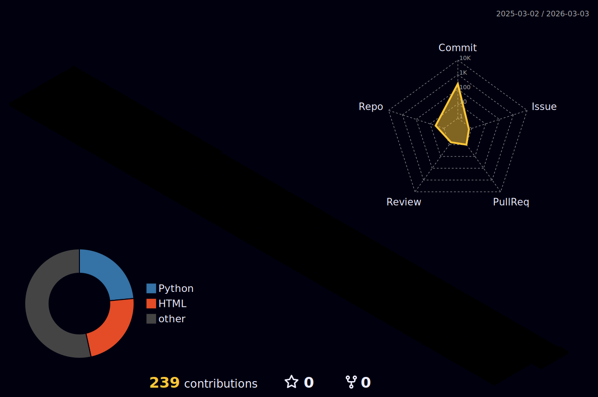

<!-- Animated Typing Header -->

<!-- Profile Views -->

---

## 🧑‍💻 About Me

- 🔭 Currently building **data pipelines** and **ML-powered applications**
- 🌱 Exploring **LLM integrations**, **MCP**, and **AI-assisted development**
- 📝 Writing about tech on my [blog](https://ice-ice-bear.github.io)
- 📫 Reach me at **3balbi7@gmail.com**

---

## 📊 GitHub Stats

---

## 🛠️ Tech Stack

 

---

## 🚀 Featured Projects

| Project | Description |
| --- | --- |
| [**log-blog**](https://github.com/ice-ice-bear/log-blog) | Python CLI that reads Chrome browsing history and publishes a Hugo blog post |
| [**hanra-reserve**](https://github.com/ice-ice-bear/hanra-reserve) | Automated reservation system built with Python |
| [**ice-ice-bear.github.io**](https://github.com/ice-ice-bear/ice-ice-bear.github.io) | Personal tech blog powered by Hugo |

---

## 📊 Top Languages

---

## 📈 Activity Graph

---

## 🧊 3D Contribution

---

🎖️ Certificates / 자격증

| Name | Issuing Authority | Date |
| --- | --- | --- |
| 정보처리기사 | 한국산업인력공단 | 2024-06-18 |
| ADsP | 한국데이터산업진흥원 | 2024-03-22 |
| SQLD | 한국데이터산업진흥원 | 2024-04-05 |
| 사회조사분석사 2급 | 한국산업인력공단 | 2019-03-14 |

**Language**

| Name | Score | Date |
| --- | --- | --- |
| TOEIC | 905 | 2023-10-14 |
| OPIc | AL (Advanced Low) | 2024-01-20 |

🏆 Competitions / 수상 경력

| Date | Title | Prize |
| --- | --- | --- |
| 2022-10 | 청년 리빙랩 프로젝트 - 지역의 재발견 | 🏆 |
| 2022-10 ~ 11 | 2022 체육종합 데이터 분석/활용 경진대회 | 🏆 |
| 2023-04 ~ 10 | 한이음 ICT 멘토링 | 📜 |

🎓 Education / 학력

| Institution | Period | Details |
| --- | --- | --- |
| 서경대학교 | 2017.03 ~ 2024.02 | 공과대학 산업시스템공학과 졸업 |
| GNT Solution (인턴) | 2022.12 ~ 2023.08 | 데이터 분석 인턴십 |

---

**Thanks for visiting!** ⭐

