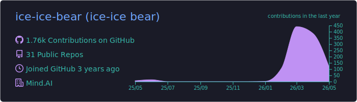
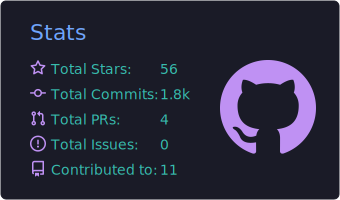
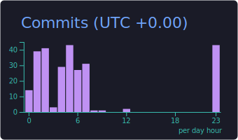
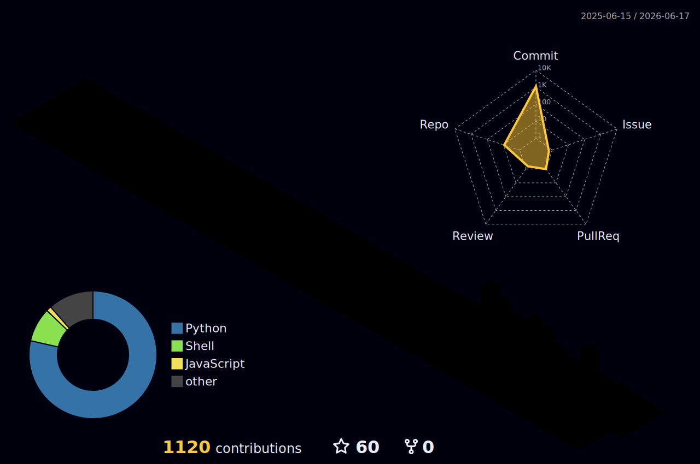

<!-- Animated Typing Header -->

<!-- Profile Views -->

---

## 🧑‍💻 About Me

- 🔭 Currently building **data pipelines** and **ML-powered applications**
- 🌱 Exploring **LLM integrations**, **MCP**, and **AI-assisted development**
- 📫 Reach me at **3balbi7@gmail.com**

---

## 📝 Blog

I write daily about **AI engineering**, **data pipelines**, **MCP integrations**, and **dev tooling**.

Posts are published in both **English** and **Korean**, auto-generated from my daily browsing & dev sessions via [**log-blog**](https://github.com/ice-ice-bear/log-blog).

---

## 📊 Profile Summary

---

## 📈 Activity Graph

---

## 🛠️ Tech Stack

**Languages** 

  

**AI / ML** 

 

  

**Backend & Data** 

 

  

**Frontend** 

 

  

**DevOps & Tools** 

 

---

## 🚀 Featured Projects

| Project | Description | Stack |
| --- | --- | --- |
| [**popcon**](https://github.com/ice-ice-bear/popcon) | Turn a single image into a complete LINE animated emoji set | `Next.js` `FastAPI` `Gemini` `Celery` `Docker` |
| [**trading-agent**](https://github.com/ice-ice-bear/trading-agent) | LLM-powered stock trading assistant with real-time market data | `React` `FastAPI` `Claude API` `MCP` `KIS API` |
| [**log-blog**](https://github.com/ice-ice-bear/log-blog) | Auto-generates bilingual blog posts from Chrome history & dev sessions | `Python` `Playwright` `Hugo` `Claude Code Plugin` |
| [**harnesskit**](https://github.com/ice-ice-bear/harnesskit) | Adaptive Claude Code plugin — detects stacks, applies guardrails, tracks sessions | `Bash` `Claude Code` `MCP` |

---

## 🧊 3D Contribution

---

🎖️ Certificates / 자격증

| Name | Issuing Authority | Date |
| --- | --- | --- |
| 정보처리기사 | 한국산업인력공단 | 2024-06-18 |
| ADsP | 한국데이터산업진흥원 | 2024-03-22 |
| SQLD | 한국데이터산업진흥원 | 2024-04-05 |
| 사회조사분석사 2급 | 한국산업인력공단 | 2019-03-14 |

**Language**

| Name | Score | Date |
| --- | --- | --- |
| TOEIC | 905 | 2023-10-14 |
| OPIc | AL (Advanced Low) | 2024-01-20 |

💼 Experience

| Company | Period | Role |
| --- | --- | --- |
| GNT Solution | 2022.12 ~ 2023.08 | Data Analysis Intern — YOLOv5 object detection, data pipeline automation |

🏆 Competitions / 수상 경력

| Date | Title | Prize |
| --- | --- | --- |
| 2022-10 | 청년 리빙랩 프로젝트 - 지역의 재발견 | 🏆 |
| 2022-10 ~ 11 | 2022 체육종합 데이터 분석/활용 경진대회 | 🏆 |
| 2023-04 ~ 10 | 한이음 ICT 멘토링 | 📜 |

---

**Thanks for visiting!** ⭐

